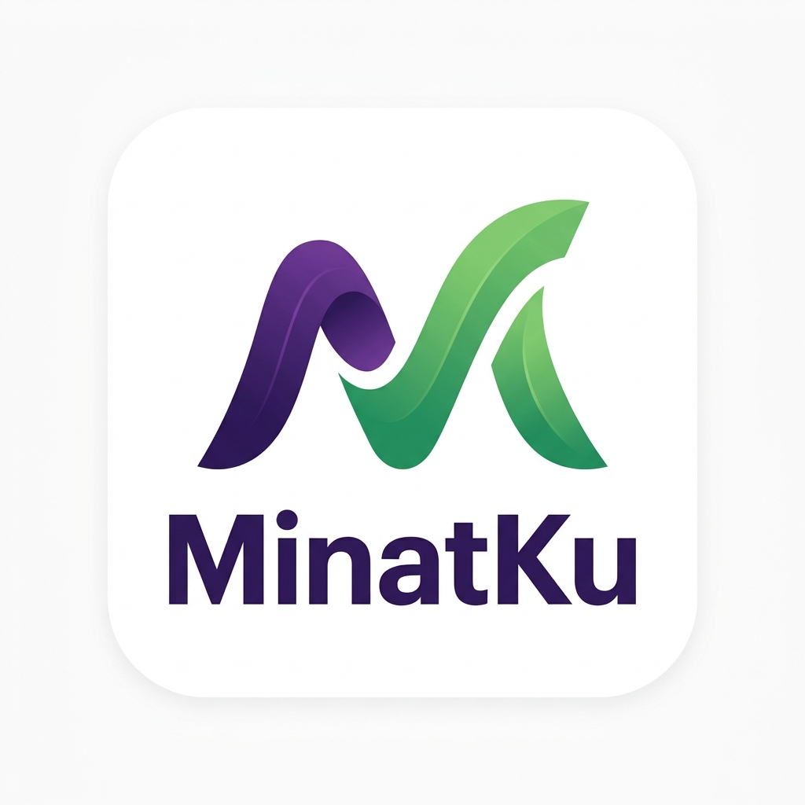
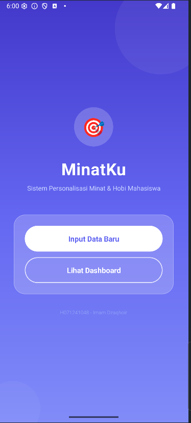
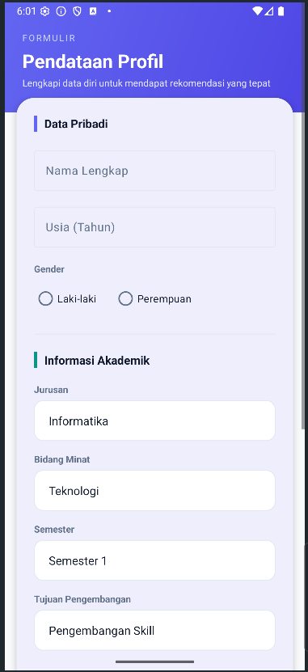

#  MinatKu
**Sistem Personalisasi & Pengembangan Minat Mahasiswa**

## 📱 App Preview
Berikut adalah tampilan antarmuka aplikasi MinatKu:

  
  

MinatKu adalah aplikasi Android modern yang dirancang untuk membantu mahasiswa mengenali, mengelola, dan mengembangkan minat serta hobi mereka. Dengan pendekatan *data-driven*, aplikasi ini memberikan rekomendasi aktivitas dan jalur pengembangan yang dipersonalisasi untuk setiap individu.

## ✨ Fitur Utama
- **🎨 Modern & Clean UI**: Antarmuka berbasis *Material Design* yang elegan dan responsif.
- **📊 Insight Global**: Analisis real-time tren minat di lingkungan mahasiswa.
- **🎯 Recommendation Engine**: Saran aktivitas (Workshop, Komunitas, Lomba) yang relevan dengan minat Anda.
- **🚀 Development Path**: Panduan langkah-demi-langkah untuk mencapai potensi maksimal di bidang yang Anda pilih.
- **📝 Intelligent Summary**: Ringkasan profil otomatis menggunakan bahasa natural yang profesional.

## 📥 Instalasi
Anda dapat mengunduh aplikasi MinatKu secara langsung melalui tautan di bawah ini:

| Sumber | Tautan Unduhan |
| --- | --- |
| **MediaFire (Latest)** | [Unduh Minatku.apk](https://www.mediafire.com/file/fpmd1gqba333cel/Minatku.apk/file) |
| **GitHub Release** | [Minatku.apk](./release/Minatku.apk) |

## 🛠️ Arsitektur Proyek
Proyek ini dibangun dengan fokus pada modularitas dan kebersihan kode:
- **DataLayer**: Centralized `DataRepository` untuk manajemen file I/O yang aman.
- **ServiceLayer**: Mesin cerdas (`RecommendationEngine`, `InsightAnalyzer`, `DevelopmentPathEngine`) yang terpisah dari logika UI.
- **Model-Centric**: Penggunaan `DataModel` yang konsisten di seluruh aplikasi.

---
*Dikembangkan oleh [ShinZeleo](https://github.com/ShinZeleo) sebagai proyek Pemrograman Mobile.*
